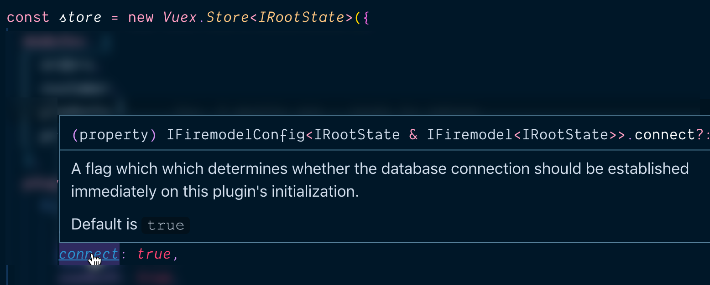

# Configuration

What you get out of this plugin in in large part related to how you configure
it. The idea behind this configuration is to take full advantage of
**Firemodel**'s watchers and in turn **Firebase**'s "real time" database
characteristics. Hopefully this idea is not foreign to you but in a nutshell
what we mean is that we should configure this plug so that we can "subscribe" to
a series of "event streams" that represent change in the database that we care
about.

## Basics

Let's take the theory down a notch and look at an example configuration:

```typescript
const config: IFirebaseConfig<IRootConfig> = {
  // config for Firebase DB
  db: {
    apiKey: "...",
    authDomain: "...",
    databaseURL: "...",
    projectId: "..."
  },
  // connect db when initialized (true is the default)
  connect: true,
  // Auth Features
  useAuth: true,
  anonymousAuth: true,
  // Lifecycle hooks
  lifecycle: {
    onConnect,
    onLogin,
    onLogout,
    onRouteChange
  }
};
```

This configuration would then be added to your initialization of this plugin
like so:

`src/store/index.ts` (or comparable)

```typescript
const store = new Vuex.Store<IRootState>({
  // ...
  plugins: [
    FirePlugin<IRootState>(config)
  ]
}
```

The details of this configuration will be explored in the following two sections:

- **Core Services** - there are some opt-in/out services that you get out of the box like `connect` and `useAuth`.
- **Lifecycle Hooks** - certain application lifecycle events are predictable and this plug-in makes it easy to take actions whenever these events are fired (all of the config under `lifecycle`) relates to that.

But before we move into these two sections let's look at some key _typings_ that will help you configure correctly:

- `IFiremodelConfig<T>` - your configuration is fully typed and beyond just a "signature", it also includes comments:

  

  > Note that in our example we broke out the `config` as a separate variable so we had to explicitly state the typing but if you configure this plugin inline with the plugin (a reasonable enough thing) the typing will just come in "for free" (as is the case in this picture).

- `IRootState` - this plugin assumes you are using Vuex _modules_ and that to garner typing information you would have already gathered your _state tree_ into a type. Right now, to get support not only for your modules but also for this plugin's typing you must do something like:

    ```typescript
      export interface IRootState {
        orders: IOrdersState
        customer: ICustomer
        products: IProductsState
        // TODO: this should be handled within the plugin
        ['@firemodel']: IFiremodelState<IRootState>
    }
    ```

  The intent is to remove this requirement but at the moment you do need to do this

## Core Services

### Connect

We **must** provide this plugin with the appropriate Firebase config to allow it
to _connect_ to the database. This is nothing more than the data that Firebase
provides to you as part of the "app settings". How you get there has changed a
bit recently (and may change again) but the first step is to choose "project
settings" (see below):


And from there you _now_ need to configure an "app" which can be a mobile or web
based app. That is a 10 second process and then you'll be presented with a
screen like you see below.


> Note: when landing on this page the radio button will have a lot of code which
> you don't need so just choose "config" and it will isolate it to just the
> configuration you'll need.

### When to Connect

By default this plugin will connect with the database immediately. That is
probably the correct behavior 99% of the time but on the chance you _don't_ want
it to connect right away you can set the `connect` property to false. If you do
this then you would take on responsibility to **dispatch** the
`@firemodel/connect` action at the point where you _do_ want to connect.

## Core Auth

### Watch Auth

Authentication and Authorization are critical features of almost every app and
Firebase provides a great set of services to make this sometimes tricky process
easy. There are, of course, other solutions out there so this plugin does _not_
assume you are using Firebase's Auth/Auth services but opting in is very easy:

```typescript
useAuth: true;
```

This flag, when set to true, will setup a callback with Firebase which allows
the plugin to be informed of any _auth_ related events. In turn it will do two
things:

1. Keep the `@firebase/currentUser` up to date
2. Call the `onLoggedIn` / `onLoggedOut` lifecycle events as appropriate.

By default, this service is turned off.

### Anonymous Authentication

In addition to just stating that you'd like to use Firebase's
authentication/authorization system, you can also opt-in to `anonymousAuth`.
When this feature is turned on this plugin will -- immediately after connecting
to the DB -- check for the appropriate tokens of a logged in user and _re_-login
the user. If, however, there is no user tokens the existing session is logged in
as an _anonymous_ user.

This means that everyone interacting with the site _will_ be a tracked user of
some sort. Some will be "known users" and others will be "anonymous users" but
all will have a unique ID that tracks the identity of the user.

## Auth Dispatch Events

Beyond the two core features that this plugin provides, the plugin also makes
parts of the Firebase Auth API surface as Vuex _actions_ that you can dispatch.
These include:

### `signInWithEmailAndPassword`

Allows an existing user to sign into Firebase with just an email and password.

You dispatch with:

```typescript
const { dispatch } from './store';
let user: UserCredential;
try {
  const user = await dispatch('@firemodel/signInWithEmailAndPassword', {
    email: string,
    password: string
  })
} catch (e) {
  // error handling
}
```

Errors include:

- `auth/invalid-email`
- `auth/user-disabled`
- `auth/user-not-found`
- `auth/wrong-password`

### `createUserWithEmailAndPassword`

Creates a new user from an email and password

You dispatch with:

```typescript
const { dispatch } from './store';
let user: UserCredential;
try {
  const user = await dispatch('@firemodel/createUserWithEmailAndPassord', {
    email: string,
    password: string
  })
} catch (e) {
  // error handling
}
```

Errors include:

- `auth/email-already-in-use`
- `auth/invalid-email`
- `auth/operation-not-allowed`
- `auth/weak-password`

For more info, check the **Firebase** docs:
[createUserWithEmailAndPassword](https://firebase.google.com/docs/reference/node/firebase.auth.Auth.html#create-user-with-email-and-password)

### `sendPasswordResetEmail`

Sends a user an email with a link to reset their password.

You dispatch with:

```typescript
const { dispatch } from './store';
try {
  await dispatch('@firemodel/sendPasswordResetEmail', {
    email: string,
    actionCodeSettings?: ActionCodeSettings | null
  })
} catch (e) {
  // error handling
}
```

Errors include:

- `auth/invalid-email`
- `auth/missing-continue-uri`
- `auth/invalid-continue-uri`
- `auth/unauthorized-continue-uri`
- `auth/user-not-found`

For more info, check the **Firebase** docs:
[sendPasswordResetEmail](https://firebase.google.com/docs/reference/node/firebase.auth.Auth.html#send-password-reset-email)

### `confirmPasswordReset`

Completes the password reset process, given a _confirmation code_ and new
_password_.

You dispatch with:

```typescript
const { dispatch } from './store';
try {
  await dispatch('@firemodel/confirmPasswordReset', {
    email: string,
    newPassword: string
  })
} catch (e) {
  // error handling
}
```

Errors include:

- `auth/expired-action-code`
- `auth/invalid-action-code`
- `auth/user-disabled`
- `auth/user-not-found`
- `auth/weak-password`

See the **Firebase** docs for more:
[confirmPasswordReset](https://firebase.google.com/docs/reference/node/firebase.auth.Auth.html#confirm-password-reset)

### `verifyPasswordResetCode`

Checks whether an out-of-band reset code was correct; if correct it will return
the user's email. Call structure would look like:

```typescript
const { dispatch } from './store';
let validatedEmail;
try {
  validatedEmail = await dispatch('@firemodel/verifyPasswordResetCode', '12345');
} catch(e) {
  // error handling
}
```

Failing conditions include:

- `auth/expired-action-code`
- `auth/invalid-action-code`
- `auth/user-disabled`
- `auth/user-not-found`

See the **Firebase** docs for more:
[verifyPasswordResetCode](https://firebase.google.com/docs/reference/node/firebase.auth.Auth.html#verify-password-reset-code)

### `updateEmail`

Updates the user's email for login/auth.

```typescript
const { dispatch } from './store';
try {
await dispatch('@firemodel/updateEmail', newEmail: string);
} catch(e) {
// error handling
}
```

Failing conditions include:

- `auth/invalid-email`
- `auth/email-already-in-use`
- `auth/requires-recent-login`

See the **Firebase** docs for more:
[updateEmail](https://firebase.google.com/docs/reference/node/firebase.User.html#update-email)

### `updatePassword`

Updates the user's password for login/auth.

```typescript
const { dispatch } from './store';
try {
  await dispatch('@firemodel/updatePassword', newPassword: string);
} catch(e) {
  // error handling
}
```

Failing conditions include:

- `auth/weak-password`
- `auth/requires-recent-login`

See the **Firebase** docs for more:
[updatePassword](https://firebase.google.com/docs/reference/node/firebase.User.html#update-password)

### `signOut`

Signs the user out of a non-anonymous account (and if anonymous authentication
is on it will log you in as an anonymous user for tracking purposes)

You will dispatch with:

```typescript
const { dispatch } from './store';
try {
  await dispatch('@firemodel/signOut')
} catch (e) {
  // error handling
}
```

Errors include:

- `auth/email-already-in-use`
- `auth/invalid-email`
- `auth/operation-not-allowed`
- `auth/weak-password`

For more info, check the **Firebase** docs:
[signOut](https://firebase.google.com/docs/reference/node/firebase.auth.Auth.html#sign-out)

## Lifecycle Hooks

### Overview

This plugin provides the following lifecycle events which you can plug into to
add/remove/update the paths in the database which you are interested in (aka,
which paths you are "watching"):

- `onConnect(initial: boolean) => void` - as soon as the database is connected;
  this is the initial connection but also applies to subsequent connections if
  the database had gone down sometime after the initial connection.
- `onDisconnect() => void` - if the database disconnects at any point after the
  initial connection.
- `onLogin(uid: string, isAnonymous: boolean, ...) => void` - as soon as a user
  is logged in then this event is fired
- `onLogout(uid: string, isAnonymous: boolean, ...) => void` - as soon as a user
  is logged out this event is fired, allowing you to cleanup/change watchers

> **Note 1:** all lifecycle hook functions are `async` functions

> **Note 2:** the `onConnect()` and `onDisconnect()` events are listened to by
> this plugin and they in turn ensure that the `@firemodel` state tree always
> has a up-to-date view on this for your application.

### Examples of Usage

Let's now take a look at a few examples of what you might do with these hooks:

#### Listen to `UserProfile` on Login

Imagine that when you login using Firebase's identity system, you want to then
start watching the database on the given logged in user's "user profile":

```typescript
export async onLogin({ uid }) {
  await Watch.record(UserProfile, uid, { name: 'user-profile' });
}
```

#### Get all `Products` once connected

Imagine we have a store application and as soon as possible we want to pull down
a list of products (and inventory levels) from the store and then be kept
up-to-date if anything changes.

```typescript
export async onConnect() {
  await Watch.list(Product).all();
}
```

#### On logging out, Stop watching `UserProfile`

Once we've logged out we should have no interest in watching the user profile of
the user who _had_ been logged in (we also probably have no rights to anymore).
In order to remove our interest in the old user's `UserProfile` we could:

```typescript
export async onLogout() {
  await Watch.stop(Watch.findByName('user-profile'));
}
```
