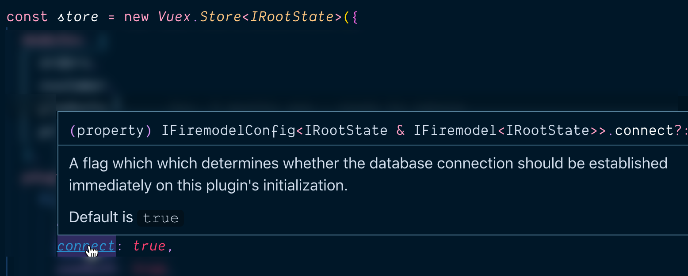
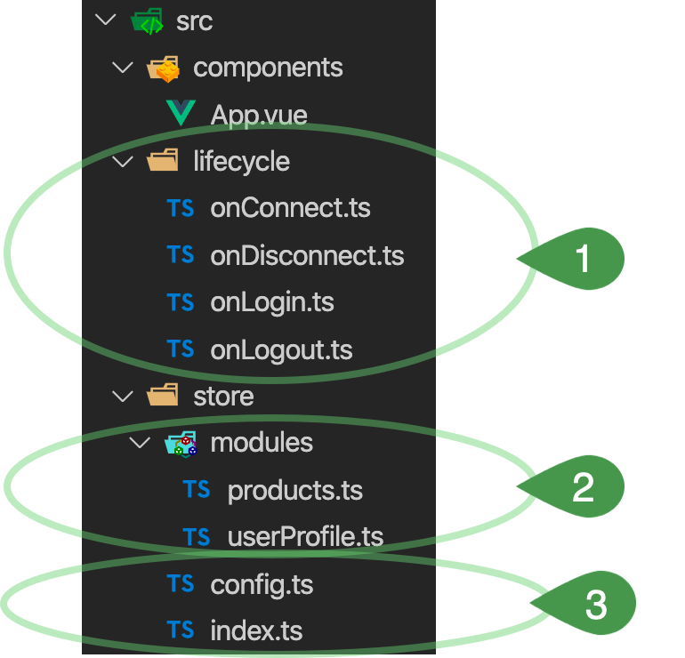

# Getting Started

After installing this Vuex plugin you'll need to configure it. We'll start with demo configuration and then talk through the key parts of the configuration so you get it conceptually.

## Example Configuration

### Add to the Plugin List

To install any Vuex plugin you must add it into an array of plugins in your store configuration. If this is the only plugin you're using it will look something like this:

**`src/store/index.ts`** (or wherever you keep your store definition)

```typescript
import Vuex from 'vuex';
import router from '../router';
import config from './config.ts';
import FirePlugin from 'vuex-plugin-firemodel';
import { sync } from 'vuex-router-sync';

Vue.use(Vuex);

const store = new Vuex.Store<IRootState>({
  // ...
  plugins: [
    FirePlugin<IRootState>(config)
  ]
}

export default store;
export const unsync = sync(store, router)
```

There are two things you'll need to have done to make the above work:

1. Define the `config` object
2. Define the `IRootState` type

We'll explore both of these next, starting with the `config` object. 

> **Note:** in this example we've included the popular `vuex-router-sync` which ensures that whenever a user 
navigates to a new route that this is pushed to Vuex as a mutuation. There is zero requirement to use this
but we find it handy -- as the router is such a key variable in state -- and if you _do_ use it we provide
the typing for your "out of the box" as well as give you a Lifecycle hook you can trigger off of.

### The Config Object

For a fairly typical
configuration you might expect to see something like this:


**`src/store/config.ts`**

```typescript
import { IFiremodelConfig } from 'vuex-plugin-firemodel';

const config: IFiremodelConfig<IRootConfig> = {
  // Firebase config
  db: {
    apiKey: "...",
    authDomain: "...",
    databaseURL: "...",
    projectId: "..."
  },
  // core services
  connect: true,
  auth: true,
  // Lifecycle hooks
  lifecycle: {
    // for all users
    onConnect,
    // only if using Firebase Auth
    onAuth,
    onLogin,
    onLogout,
    // only if using vuex-plugin-router
    onRouteChange
  }
};
```

This configuration would then be added to your initialization of this plugin
like so:


The details of this configuration will be explored in the following three sections:

1. **DB Configuration** - you must provide the normal Firebase client configuration so this plugin can connect to the database for you (alternatively you can provide config for a "mock database" ... more on that later)
2. **Core Services** - there are core services that you get out of the box which you can opt-in/out of.
3. **Lifecycle Hooks** - certain application lifecycle events are predictable and this plug-in makes it easy to take actions whenever these events are fired (all of the config under `lifecycle`) relates to that.

### The `IRootState` Type

But before we move into these sections let's look at some key _typings_ that will help you configure correctly:

- `IFiremodelConfig<T>` - your configuration is fully typed and beyond just a "signature", it also includes comments:

  

  > Note that in our example we broke out the `config` as a separate variable so we had to explicitly state the typing but if you configure this plugin inline with the plugin (a reasonable enough thing) the typing will just come in "for free" (as is the case in this picture).

- `IRootState` - this plugin assumes you are using Vuex _modules_ and that to garner typing information you would have already gathered your _state tree_ into a type. Right now, to get support not only for your modules but also for this plugin's typing you must do something like:

    ```typescript
      export interface IRootState {
        orders: IOrdersState
        customer: ICustomer
        products: IProductsState
        // TODO: this should be handled within the plugin
        ['@firemodel']: IFiremodelState<IRootState>
    }
    ```

  The intent is to remove this requirement but at the moment you do need to do this

## Core Services


### Connect

If you don't want to connect to a Firebase database you're using the wrong Vuex plugin but 
on occation you may decide that you want to have manual control over when the database is 
connected. By default it will just connect immediately and this is the right choice 99% of
the time but if you want to do it manually set this service to false:

```typescript
connect: false,
```

By default this plugin will connect with the database immediately. That is
probably the correct behavior 99% of the time but on the chance you _don't_ want
it to connect right away you can set the `connect` property to false. If you do
this then you would take on responsibility to **dispatch** the
`@firemodel/connect` action at the point where you _do_ want to connect.

### Auth

Authentication and Authorization are critical features of almost every app and
Firebase provides a great set of services to make this sometimes tricky process
relatively easy (not to mention making the database's security rules much more powerful).
There are, of course, entitled to use other solutions out there 
so you can set this to false if you don't plan on using it:

```typescript
auth: false,
```

For most use cases though you _will_ use the **auth** module and you can either leave
it off of the configuration or set it to `true` to set it up with the default configuration.

```typescript
auth: true,
```

If you want to change the configuration you can replace the boolean `true` value with a dictionary of
any of the below attributes:

- `presistence` - provides a way to state how long the Firebase client should
remember the user for. The options are: _none_, _session_, and _local_ and if 
not stated the default is _local_. For more details see the docs: 
[Auth State Persistence](https://firebase.google.com/docs/auth/web/auth-state-persistence)
- `anonymous` - a powerful feature of the Firebase Auth is to give visitors
an "anonymous user" account when they land. By doing so the user is now more 
easily tracked and this can be quite helpful for understanding how non-users of
your solution are viewing the site prior to (hopefully) signing up. By default
this is turned off but by setting to _true_ you will immediately have visitors
either be "known users" or "anonymous users" and thereby always have a `uid` to
use for tracking.

A popular configuration choice is:

```typescript
auth: { persistence: 'session', anonymous: true }
```

Which keeps a user logged in for the session but no longer and then keeps active
tracking when logged in by staying "logged in" as an anonymous user.

## Lifecycle Hooks

### Overview

This plugin provides the following lifecycle events which you can plug into to
add/remove/update the paths in the database which you are interested in (aka,
which paths you are "watching"):

- `onConnect()` - as soon as the database is connected;
  this is the initial connection but also applies to subsequent connections if
  the database had gone down sometime after the initial connection.
- `onDisconnect()` - if the database disconnects at any point after the
  initial connection.

For configurations that are using Firebase's Auth solution, the following events
will also be available:

- `onAuth()` - When a user first arrives on the site/app, there is a two step process
  where first we must 
- `onLogin(uid: string, isAnonymous: boolean, ...) => void` - as soon as a user
  is logged in then this event is fired
- `onLogout(uid: string, isAnonymous: boolean, ...) => void` - as soon as a user
  is logged out this event is fired, allowing you to cleanup/change watchers

Finally, for those users who have configured their state tree to include the apps
current route, then you will also receive:

- `onRouteChanged()`


## Vuex Module Configuration
### Assumptions
We make the following assumptions when using this plugin:

- We assume you are using _module scoping_ for your Vuex modules. If you aren't familiar with this you can read more about this on the [Vuex site](https://vuex.vuejs.org/guide/modules.html).
- We expect there to be a module per **Firemodel** `Model` which you intend to you use in your app
- You can have as many state modules as you like which _aren't_ driven by **Firemodel** but once you become familiar with the power of Firemodel modules we suspect the exceptions will be limited

Based on these assumptions -- and assuming you have a `UserProfile` and `Product` module you want use in your app -- you might expect to find a directory structure something like this:



The main focus at the moment is section #2 where we'll put our Vuex module configuration.

### Example Configuration

Picking up with the idea that we have a `UserProfile` and `Product` model that we're using in our app ... we'd need to have a Vuex module definition file for each. They'd look almost identical (at least to start), for instance:

**`src/store/modules/product.ts`**

```typescript{3,13}
import { Product } from 'my-models-repo'
import { Module, GetterTree, MutationTree } from 'vuex'
import { firemodelMutations } from 'vuex-plugin-firemodel'

export interface IProductState {
  all: Product[]
}

const state: IActivityState = {
  all: []
}
const mutations: MutationTree<IActivityState> = {
  ...firemodelMutations()
}
const getters: GetterTree<IActivityState, IRootState> = {}
const vuexModule: Module<IActivityState, IRootState> = {
  state,
  mutations,
  getters,
  namespaced: true,
}

export default vuexModule
```

If you've used Vuex's typing classes a lot of this may look familiar and you'd be right to note that it's 99% boilerplate code but consider this a _starting point_ but a super-powered starting point.

### Super Powers

Why did we say the example module configuration had "super-powers"? Well, outside a flare for the dramatic, it's because without writing a single **Mutation** all of your mutations are already written! This is accomplished with the lines highlighted in the example above. 

How this is achieved is more an implementation detail but if you dial your browser's devtools to the Vue module you'll start to see mutations like `products/SERVER_ADD` when you're watching the products or `products/ADDED_LOCALLY` and `products/SERVER_CONFIRMED` when you add a new record with something like:

```typescript
await Record.add(Product, { ... });
```

This will all start to make more sense as you learn about the Firemodel and ABC API's and see how this impacts your Vuex mutations and state. For now just bask in your new found super powers ... I hear Amazon has a sale on superhero capes at the moment if you're in the mood.